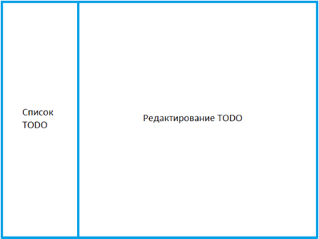

# Тестовое задание для стажера на позицию "Программист на языке JS"

## Предстоящие шаги

1. Добавить запуск на github
2. Вынести хранение заметок в куки
3. Сделать сохранение ширины списка TODO в куках
4. Добавить тесты
5. Добавить возможность добавления, релактирования и удаления заметок
6. Добавить обрезку наименования заметки "..." на конце
7. Добавить хранения текущего статуса заметки (ожиджает/в процессе/выполнена)
8. Добавить поиск заметок по имени
9. Добавить сохранение локально
10. Добавить поддержку ui для мобильных устройств

* Изменения в дизайне всегда приветствуются

## Дано

JS, CSS (SCSS, SASS)

## Максимальное время на выполнение задания — 2 недели

Целью задания является написание TODO List приложения

## Основные цели

* Приложение должно включать в себя минимум два основных компонента (примерный вид приложения см. на рисунке выше):
  1. Вертикальный список с наименованиями заметок TODO;
  2. Область взаимодействия заметки TODO
* Реализовать возможность добавления, редактирования и удаления заметок TODO;
* Обрезать конец наименования заметки TODO “…”, если имя не влезает в вертикальный список наименований заметок TODO.

## Дополнительные цели

* Добавить цветовую индикацию состояния прогреса выполнения заметок TODO (состояния: ожидает/в процессе/выполнена);
* Добавить поиск заметок TODO по имени;
* Добавить возможность изменения ширины списка наименований заметок TODO, по удержании и перемещении правой границы курсором компьютерной мыши;
* Реализовать приложение на React+JS или React+TS (предпочтительнее использовать [createReactApp](https://create-react-app.dev/)).

**Использование фреймворков и библиотек, <u>кроме React</u>, не разрешено. Комментирование кода с пояснениями – обязательно.**

Решение задачи назместить на [github](https://github.com/)

Ссылку на решение нужно вставить в файл Word и прикрепить к заявке на стажировку.
